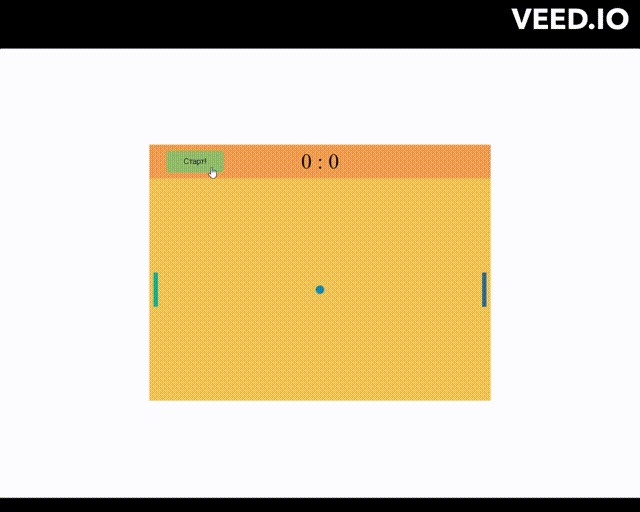

# Ping-pong Canvas

## Браузерная игра пинг-понг

Цель данного проекта:

1. Работа с полотном **Canvas** и его **анимация**
2. Практика применения **обработчиков событий**
3. **ES6** модули
4. **ООП**
5. Применение метода **requestAnimationFrame()**

### Управление игрой

Левый игрок:

- вверх LeftShift
- вниз LeftControl

Правый игрок:

- вверх ArrowUp
- вниз ArrowDown

[Click to show](https://brainhdv.github.io/ping-pong-canvas)
